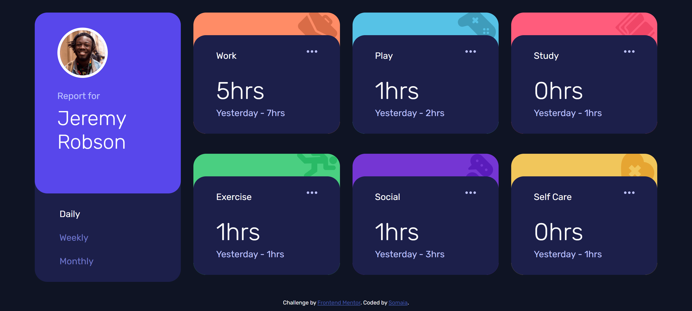
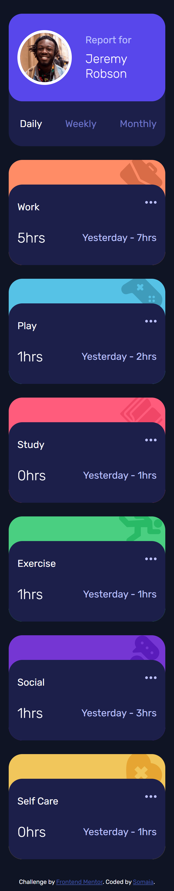

# Frontend Mentor - Time tracking dashboard solution

This is a solution to the [Time tracking dashboard challenge on Frontend Mentor](https://www.frontendmentor.io/challenges/time-tracking-dashboard-UIQ7167Jw). Frontend Mentor challenges help you improve your coding skills by building realistic projects. 

## Table of contents

- [Overview](#overview)
  - [The challenge](#the-challenge)
  - [Screenshot](#screenshot)
  - [Links](#links)
- [My process](#my-process)
  - [Built with](#built-with)
  - [What I learned](#what-i-learned)
  - [Continued development](#continued-development)
  - [Useful resources](#useful-resources)
- [Author](#author)
- [Acknowledgments](#acknowledgments)


## Overview

### The challenge

Users should be able to:

- View the optimal layout for the site depending on their device's screen size
- See hover states for all interactive elements on the page
- Switch between viewing Daily, Weekly, and Monthly stats

### Screenshot




### Links

- Live Site URL: [Live site](https://somaia02.github.io/time-tracking/)

## My process

### Built with

- Semantic HTML5 markup
- CSS custom properties
- Flexbox
- CSS Grid
- Mobile-first workflow
- SASS, SCSS

### What I learned

I used SASS for the first time. Since all cards have the same styles except for the color and icon at the top, I used a mixin.

```scss
@mixin card-icon($icon-path, $bg-color) {
  background-color: $bg-color;
  &::before {
    content: url($icon-path);
    position: absolute;
    right: 5px;
    top: -5px;
    z-index: -1;
  }
}
.work {
  @include card-icon("images/icon-work.svg", var(--orange-300));
}
```

### Continued development

I want to learn more about best practices for writing CSS and JavaScript. Things work out but I'm not sure if my approach is the best. I need to read more code written by experts.

